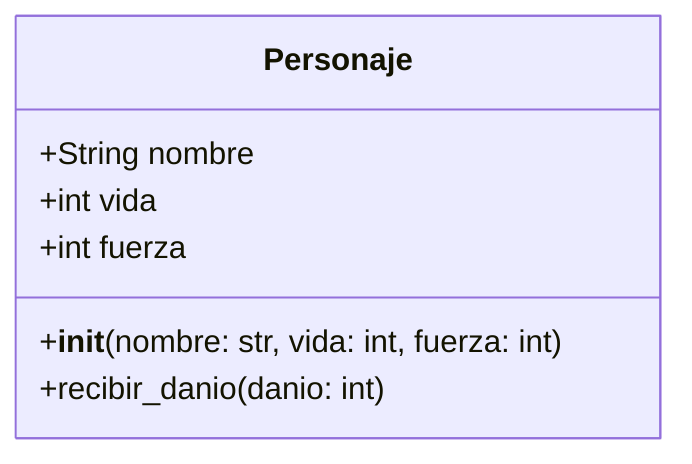

# 81952-BOOTCAMP-FREIXAS

#diagrama mermaid

# otro diagrama de mermaid
classDiagram
    class Juego {
        +Mapa mapa
        +Jugador jugador
        +iniciar()
        +actualizar()
        +dibujar()
    }

    class Jugador {
        +float x
        +float y
        +int vida
        +int velocidad
        +mover()
        +atacar()
        +recibir_danio(danio)
    }

    class Enemigo {
        +float x
        +float y
        +int vida
        +int danio
        +mover()
        +atacar()
    }

    class Proyectil {
        +float x
        +float y
        +int danio
        +mover()
        +impactar()
    }

    class Mapa {
        +int ancho
        +int alto
        +cargar()
    }

    Juego *-- Jugador
    Juego *-- Enemigo
    Juego *-- Proyectil
    Juego *-- Mapa

    Jugador --> Proyectil : dispara
    Enemigo --> Jugador : ataca
